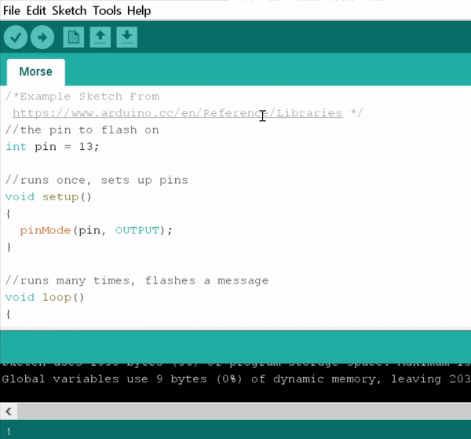
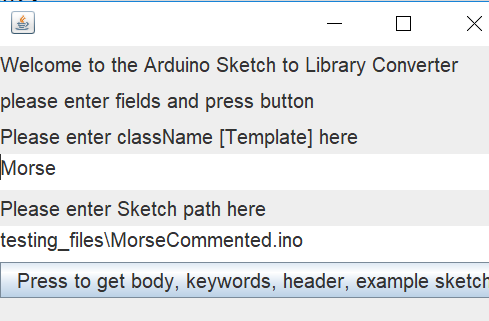
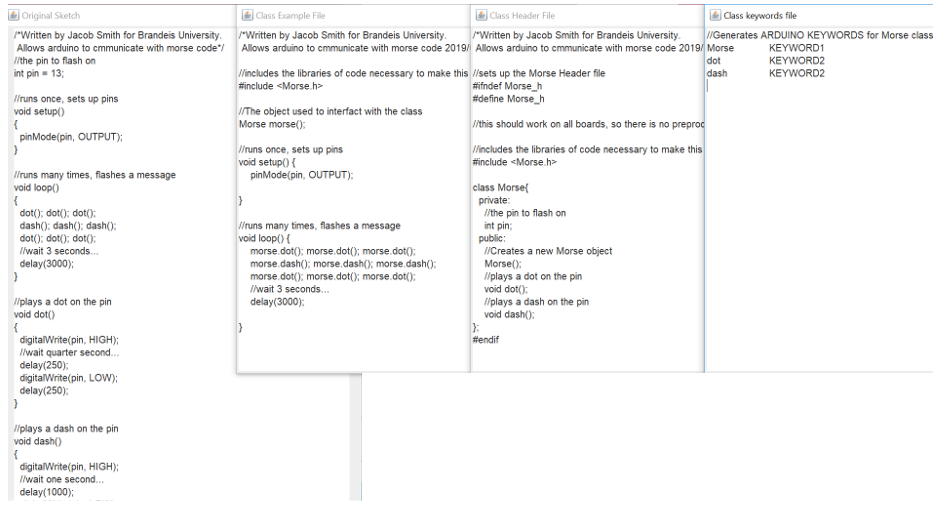

# ArduinoClassMaker

## Quick Description

##### A set of java programs to automatically generate arduino library header (.h), body (.cpp), keywords (.txt), and example sketch (.ino) from a working Arduino (.ino) sketch.

	

## Instructions For Use

### In Arduino IDE:

#### 		Purpose:

​		For users who want to create libraries from the [Arduino IDE](https://github.com/arduino/Arduino), the project can be integrated so it works like this:

​	

#### 	Instructions

 	1. Install the tools to [compile the Arduino application](https://github.com/arduino/Arduino/wiki/Building-Arduino) yourself
	2. Copy the ClassGeneratorInterface class from src/processing/app into Arduino/app/src/processing/app
	3. Copy ArduinoClassGenerator Folder in src/cc to  Arduino/src/cc 
	4. Note:My RunArduino.bat  file copies the folders from this github repo into the Arduino project and runs it for Windows

### As a standalone file editor

#### 		Purpose

​		For users who want to create class files independent of other software, you will be able to do this:

##### 					Dialogue to create Arduino class

​			

##### 					Arduino Class Files Generated											

#### 	Instructions

1. Click on Runme.jar, which will allow the user to enter the name of the class to generate and the file 	path it is in.
2. When you click on the body, the editable files are displayed.
3. Note: I deleted the code used to generate the .jar file on May 31, 2019 to focus on the Arduino IDE integration.

## Project Information

### **Background:** 

​	I haven't found any tool that generates Arduino Libraries. 	Probably the closest is [Sloeber](http://eclipse.baeyens.it/installAdvice.shtml), a great IDE providing autocomplete, automatic library includes, and other professional features.

### **Introduction:** 

​	That is why I created a ArduinoClassGenerator, a tool which converts Arduino Sketches into [Arduino libraries](https://www.arduino.cc/en/Hacking/LibraryTutorial). While working on my project, I have found that the best workflow for me to create arduino libraries is to write a .ino sketch with the behavior I want, and then sort out that code into the .h, .cpp, example file, and keywords file manually or with a template.

### **Implementation:** 

​	However, I realized that much of this work can be done for me, so I created a java class which reads the Morse.ino or other sketch, and parses it (MorseParsed) into a format containing the essential information, like variable type, name, value, and comments.

Then, my Java program generates a cpp (Morse.cpp), .h (Morse.h), keywords (MorseKeywords.txt), and example file (MorseExampleFile.ino). It can do this because all of the information is contained in the parsed file. This means that instead of copy pasting variable names from a header to body file, the computer does the busywork. In addition, the program can identify which methods should be public by whether they are called in the loop and setup methods.

### **Advantages:** 

Such a tool could save advanced programmers the time of typing out a class from a sketch, and could be used to encourage good programming practices like commenting and including a keywords file. In addition, this tool could help programmers who might not format their code for easy sharing to do so.

### **Features:** 

#### 	Current :   

- ​	Arduino Class: header, file, example and keywords files can be generated by creating an ArduinoClassContainer object given strings containing information about the class like variables and methods. 
- Parsing tools and SketchParser class to generate those strings so the files can be created from an Arduino sketchs, MorseParsed.txt file for the format

- Integration with Arudino IDE using ClassGeneratorInterface class.

- Unit tests to show usage of programs and enforce standards

  #### Previous: (email jsmith2021@brandeis.edu if interested)

- Ability to prompt user for formatted strings so experiences users can quickly create a class from scratch

- Ability to prompt user for individual fields so they don't need to know anything about the formatting rules for fields to generate arduino class files

- Interface to generate class files independent of any development environment, click on runMe.jar

  #### Planned for Future: (add to this to make a feature request)

- The format used by sketchParser could allow for a simplified arduino programming language.

- The classes generated could go into a folder structure and with additional files to [publish the library to github](https://github.com/arduino/Arduino/wiki/Library-Manager-FAQ)

- Integration with release of an IDE, probably either [Sloeber](https://eclipse.baeyens.it/) or [Arduino](https://www.arduino.cc/en/Main/Software)

### License

​	This repository is licensed under the [gnu general public license v 3.0](https://www.gnu.org/licenses/gpl-3.0.en.html)

​	This is the same license as the [Arduino repository](https://github.com/arduino/Arduino)

### Acknowledgment

​	I thank Professor Pito Salas for his advice on documentation and Timothy Hebert for his support of the Zumo automation project that gave me the idea to make this project.

### Problems/Contributing

​	If there is a problem, [submit an issue on github](https://help.github.com/en/articles/creating-an-issue) or email jsmith2021@brandeis.edu

​	To contribute to the project, [submit a pull request](https://help.github.com/en/articles/creating-a-pull-request) on github or email same adress

